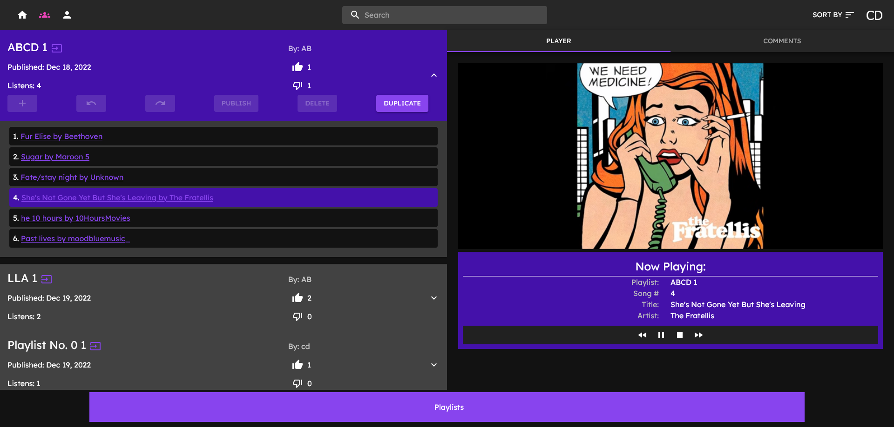

# Playlister

## Run with Docker

1. Install Docker
2. `docker-compose up`
3. Go to `localhost:3000`

## Run without Docker

1. Install Node.js
2. Install MongoDB
3. `npm start` in `./client`
4. Change the first line of `./server/.env` to
  `DB_CONNECT=mongodb://127.0.0.1:27017/playlists`
5. `npm start` in `./server`
6. Go to `localhost:3000`

